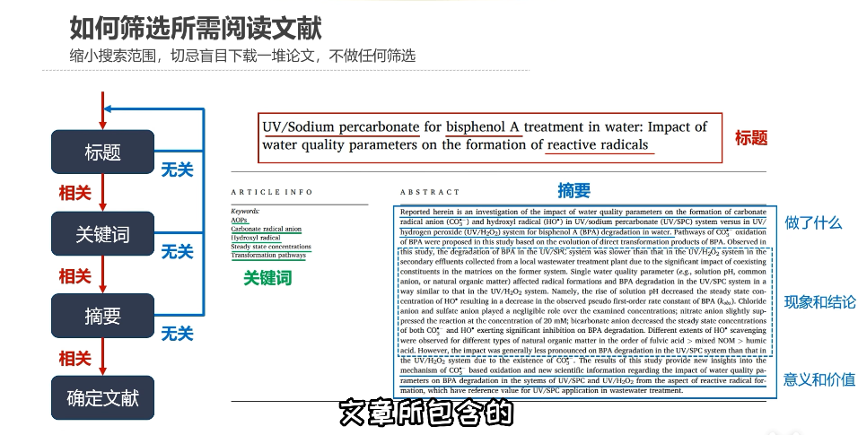
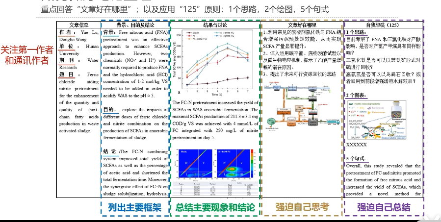

# 文献阅读及笔记整理

Lee de

## 引言

* 要有找论文、读论文的方法，**学的是解决问题的能力**
* **好奇和实践**
* 做文献阅读的四个作用
  * 了解背景知识：硕博学位论文，领域大牛文献综述
  * 把握课题研究方向：行业最新论文，领域大牛文献综述
  * 学习课题设计思路：不仅仅局限于本领域最新研究论文
  * 提升逻辑写作能力：顶刊


## 找论文

### 利用学校资源的方法

[电子资源](http://library.xaut.edu.cn/home/service/0/17)

### 网络资源的使用

关键词搜索

百度学术/谷歌学术/领域学报/博客/交流平台

## 筛选论文

### 论文的结构

    1、title(标题)
    2、abstract(摘要)
    3、intro(导言)
    4、method(提出的算法)
    5、exp(实验)
    6、conclusion(结论)

当然文章可以从头读到尾，但是一个领域论文这么多，时间划不来，而且适合的文章可能就一小部分，需要快速找到适合的文章，并对它进行精读。

### 标题、关键词、摘要、确定文献



### 工具

1. 文献鸟（Storkapp.me）

2. Connectpapers.com

   * Prior Works 敲门砖，最常被引用的论文

   * Derivative Works 垫脚石，该领域新的综述或相关研究工作

## 论文阅读

> 根据目的选择论文阅读的深度：选择性阅读与全文精度

### 第一遍（海选）

    需要关注标题【了解这篇论文是不是跟自己相关】；
    摘要【简单的介绍这篇论文在做什么】；
    然后直接跳到结论【通常跟摘要是一样的，但是把摘要中提到的一两个问题用一些实际的结论，实际的数字证明了一下】
    然后可以跳到实验部分看一些关键的图和表；
    然后也可以去瞄一眼在方法里面的图和表；
    
    这样大概可以通过十几分钟的时间就可以知道这篇论文在讲什么了，质量怎么样，结果怎么样，方法怎么样，是不是适合自己，从这里就可以决定要不要继续读下去，要读的话就走第二遍。

选文献，看结论方法，先用全文，网页翻译看，有价值，中英对照

阅读笔记要记，摘要结论时间

### 第二遍（重点精读）

    对整个文章过一遍【从标题一直往下读到最后】，知道每一块到底在干什么东西；
    
    这时候不用太注意很多的细节，公式、特别的证明或者一些很细节的部分可以忽略掉，主要是搞清楚重要的图和表，知道每一个字都在干什么【流程图长什么样子；算法的图长什么样子；实验里面每张图的x轴y轴在干什么，每个点是什么意思；作者提出的方法跟别人的方法是怎么对比的，之间的差距有多大】
    这时还没有特别没有搞得懂他在干什么，这个可以标记，留到之后
    
    在这一遍大概对整个论文的各个部分都有一个大概的了解，可以将相关的文献圈出来【作者根据其他的观点提出来的，或是改进的等等，这些文献没有读过的话可以圈出来】，读完之后就可以继续判断要不要继续往下读，

精读文献，按照框架读

这一步，知道文章解决什么问题，结果怎么样，大概用了什么方法，便可以判断下一步如何做：继续还是别的文章。

### 第三遍（研读）

    在这一遍需要知道每一句话在干什么，每一段在说什么；
    在大脑中脑补整个过程是怎样的，使得自己想做过了一样；
    在读的过程中，思考自己来完成作者所提出的问题时需要怎么做，需要用什么方法来实现这个东西；
    在读实验部分时，思考自己能不能比作者做的更好；作者留下的问题，思考自己能不能继续往前走
    在这一遍对整个文章的细节都了解，可以回忆的出文章很多细节的部分，然后在之后基于他做研究，或者在之后提到它的时候，可以详详细细的复述一遍。 
## 文献笔记与知识消化

### 思维导图

### PDCA

> 就像以前学课程一样，第一遍快速过课程，了解框架重点；第二遍认真学，抓重点，搞细节，做习题；第三遍就是很轻松的复习了，一般在实践以后，再来看那些看起来理解了但又有新的理解，以及其前没有留意的地方，看起来很简短但又很深刻，可能被扩展，与其他部分有联系的地方

### 笔记模板



### 一些补充

谷歌镜像网站（http://scholar.scqylaw.com/）

阅读中文综述（了解术语概况）

```
硕博论文前言综述（决定毕设论文框架），参考文献，高引文献
英文综述，文献，用于创新（阅读时一个问题，不同文献围绕，成辐射状系统）

xxx survey

综述

研报
```

## 相关文章

【1】https://web.stanford.edu/class/ee384m/Handouts/HowtoReadPaper.pdf

【2】https://mp.weixin.qq.com/s/WS079LD8EfEbC-RBy2JHYg

【3】[B站——做好文献阅读及笔记整理](https://www.bilibili.com/video/BV17W4y167SM?share_source=copy_web&vd_source=0fa55f3cb28354ba8598979d65ef8d60)