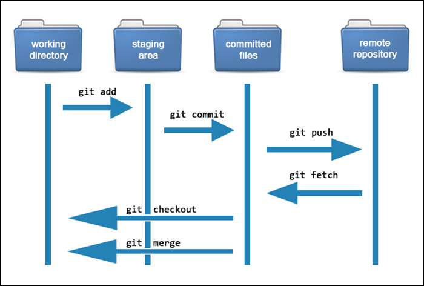

# Git

Git允许用户使用简单的命令跟踪代码更改并管理他们的项目。

Git 的核心是用于包含项目的**存储库**。存储库可以存储在本地或网站上，例如 GitHub。Git 允许用户存储多个不同的存储库并独立跟踪每个存储库。

[Git原理示例解释](https://www.lsbin.com/tag/git原理示例解释/)：在整个开发过程中，该项目有几个保存点，称为**commits**。提交历史包含所有提交，即开发期间在项目中实施的更改。提交允许你将代码回滚或快进到提交历史记录中的任何提交。

Git 使用**SHA-1 哈希值**来引用提交。每个唯一的哈希指向存储库中的特定提交。使用哈希，Git 创建了一个树状结构来轻松存储和检索数据。

每个 Git 项目中的文件都会经历几个阶段：

-   **工作目录**。修改过的文件，但未跟踪且尚未准备好提交。
-   **暂存目录**。将修改后的文件添加到暂存环境意味着它们已准备好提交。
-   **提交**。提交历史记录中保存的暂存区文件的快照。

# Reference

[Git工作原理介绍：Git是如何工作的？](https://www.lsbin.com/9389.html)

[Git系列：如何重命名仓库，并同步远程仓库](https://www.coonote.com/git-note/git-rename-github-push.html)

[Git忽略提交规则 - .gitignore配置运维总结](https://www.cnblogs.com/kevingrace/p/5690241.html)